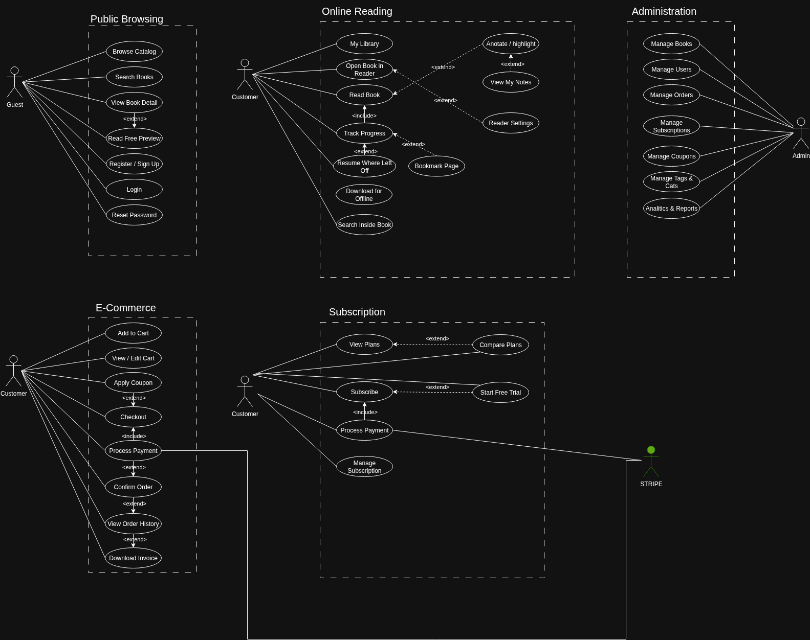
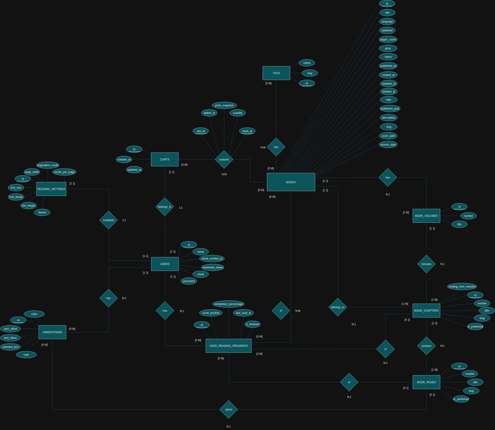
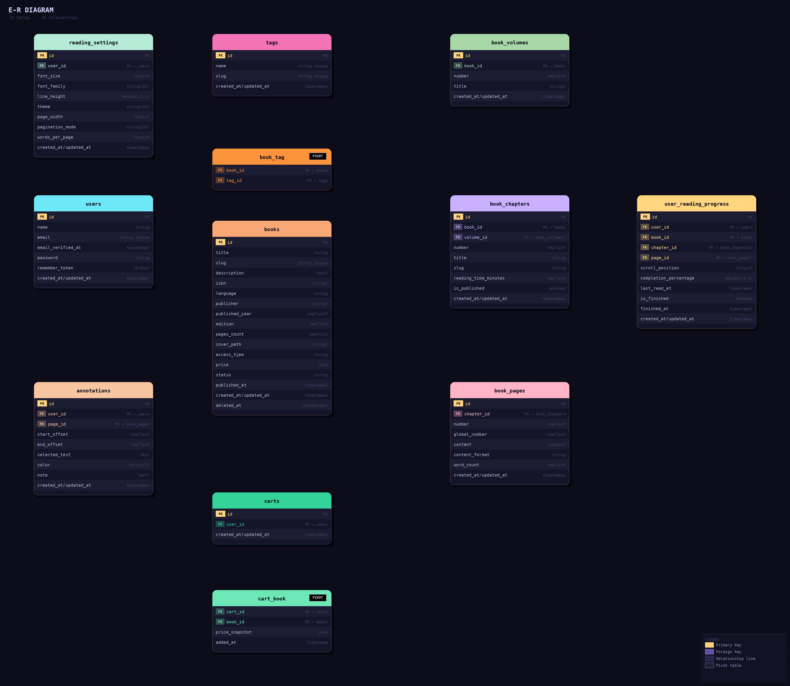

🇪🇸 [Español](README.md) | 🇬🇧 [English](README.en.md)

# 📚 BookShop - Plataforma de Venta y Suscripción de Libros


BookShop es una plataforma web que permite a los usuarios **comprar libros digitales, suscribirse para acceder a una biblioteca de lectura y gestionar su perfil y pedidos**.

El proyecto también incluye un **panel de administración** para gestionar libros y el catálogo de la tienda.

Desarrollado con **Laravel** + **Vue.js**, aplicando principios SOLID y siguiendo metodologías ágiles (Agile) en el desarrollo y desplegado de manera segura con **Docker** en https://booksplanet.store

---

# 🚀 Funcionalidades

## 👤 Usuarios

- Registro y autenticación de usuarios
- Gestión de perfil
- Visualización de pedidos realizados
- Compra de libros individuales
- Suscripción mensual/anual para acceso a biblioteca
- Lectura de libros disponibles mediante suscripción

---

## 📚 Tienda de Libros

- Catálogo de libros
- Página de detalle de cada libro
- Compra individual de libros
- Acceso a libros incluidos en suscripción
- Lectura online de libros mediante suscripción
- Sistema de pagos con **Stripe**

---

## 💳 Pagos

Integración con **Stripe** para:

- Pago de libros individuales
- Pago de suscripciones
- Gestión de estados de pago

---

## 📦 Gestión de Pedidos

El sistema registrará:

- Pedidos realizados por el usuario
- Historial de compras
- Estado del pedido
- Libros incluidos en cada pedido

---

## 🔑 Panel de Administración

El administrador podrá:

- Crear libros
- Editar libros
- Eliminar libros
- Gestionar catálogo
- Visualizar pedidos

### CRUD de Libros

Campos principales:

- id
- title
- slug
- description
- isbn
- language
- publisher
- published_year
- edition
- pages_count
- cover_path
- access_type (ej. subsciption, individual, etc)
- price
- status (ej draft, published, etc)
- published_at
- timestamps
- softDeletes
---

### Diagrama Use Case




## 🏗 Arquitectura del Sistema


# 🧱 Arquitectura del Proyecto

El proyecto sigue una arquitectura moderna basada en:

- **Backend API:** Laravel
- **Frontend público:** Server Side Rendering (SSR)
- **Panel de administración:** Client Side Rendering (CSR) con Vue.js
- **Base de datos:** PostgreSQL
- **Contenedores:** Docker

Estructura simplificada:
```bash
bookshop/
│
├── book-store-backend
├── book-store-frontend
├── book-store-docker
├── docs
└── README.md
```

---
## ⚙️ Estrategia de Renderizado

La plataforma utiliza una **arquitectura híbrida de renderizado** para optimizar SEO, rendimiento e interactividad.

### Server Side Rendering (SSR)

Utilizado en la parte pública de la plataforma:

- Catálogo de libros
- Páginas de detalle
- Landing pages
- Contenido indexable

Ventajas:

- Mejor SEO
- Renderizado inicial más rápido
- Mejor indexación por motores de búsqueda

### Client Side Rendering (CSR)

Utilizado en:

- Panel de administración
- Lector interactivo de libros

Ejemplos:

- Gestión de libros (CRUD)
- Gestión del catálogo
- Administración del sistema

Ventajas:

- Experiencia de aplicación tipo SPA
- Interacciones más rápidas
- Menor recarga de página
- No requiere optimización SEO intensiva

# 🛠 Tecnologías Utilizadas

## Backend

- Laravel 12
- PHP 8+
- Eloquent ORM
- Laravel Authentication
- Laravel Policies / Middleware
- FormRequests
- Laravel Sanctum

## Frontend


👉 **[Ver prototipo interactivo](https://zhenyax14.github.io/book_shop/design/concept-art.html)**

- Vue.js 3
- Inertia.js
- Server Side Rendering (SSR) (Parte pública)
- Client Side Rendering (CSR)  (Panel de admin, lector de libros)
- Vite
- HTML5
- CSS3
- Bootstrap y SCSS

## Pagos

- Stripe
- Stripe Webhooks

## Infraestructura

- Docker
- Docker Compose
- Nginx
- PostgreSQL

## SEO

- Google Search Console
- Google Analytics
- Optimización de HTML

## Alojamiento

El proyecto está desplegado en:

https://booksplanet.store

Infraestructura:

- VPS Linux
- Docker
- Nginx
- PostgreSQL

---

# 📋 Requisitos Técnicos

Para ejecutar el proyecto necesitas:

- Docker
- Docker Compose
- Git

Opcional (si se ejecuta sin Docker):

- PHP 8.2+
- Composer
- Node.js 18+
- npm o pnpm
- PostgreSQL

---

# 🐳 Instalación con Docker

## 1. Clonar el repositorio

```bash
git clone https://github.com/zhenyax14/book_shop.git
cd book_shop
```

## 2. Copiar el archivo de entorno
Copiar las variables de entorno por defecto:
```bash
    cp .env.example .env
```
Editar:
```bash
    nano .env
```
Introducir las credenciales DEV o PROD:
```
    DB_DATABASE=bookshop
    DB_USERNAME=root
    DB_PASSWORD=root
    
    STRIPE_KEY=your_key
    STRIPE_SECRET=your_secret
```

## 3. Levantar los contenedores
```bash
  docker compose up -d
```
## 4. Instalar dependencias
```bash
    docker compose exec app composer install
    docker compose exec app npm install
    docker compose exec app npm run dev
```

## 5. Generar clave de aplicación
```bash
    docker compose exec app php artisan key:generate
```

## 6. Ejecutar migraciones
```bash
    docker compose exec app php artisan migrate
```

# 📊 Modelo de Datos



Principales entidades del sistema:

### Users

- id
- name
- email
- email_verified_at
- password
- role
- remember_token
- timestamps

### Books

- id
- title
- slug
- description
- isbn
- language
- publisher
- published_year
- edition
- pages_count
- cover_path
- access_type (ej. subsciption, individual, etc)
- price
- status (ej draft, published, etc)
- published_at
- timestamps
- softDeletes

### Tags

- id
- name
- slug
- color
- created_at
- updated_at


### Book Tags (Tabla pivote)

- book_id
- tag_id


### Book Volumes

- id
- book_id
- number
- title
- timestamps

### Book Chapters

- id
- book_id
- volume_id
- number
- title
- slug
- reading_time_minutes
- is_published
- timestamps


### Book Pages

- id
- chapter_id
- number
- global_number
- content
- content_format
- word_count
- timestamps

### User Reading Progress

- id
- user_id
- book_id
- chapter_id
- page_id
- scroll_position
- completion_percentage
- last_read_at
- is_finished
- finished_at
- timestamps

### Bookmarks

- id
- user_id
- book_id
- page_id
- label
- color
- timestamps

### Annotations

- id
- user_id
- page_id
- start_offset
- end_offset
- selected_text
- color
- note
- timestamps

### Reading Sessions

- id
- user_id
- book_id
- start_page_id
- end_page_id
- started_at
- ended_at
- pages_read
- duration_seconds
- timestamps

### Orders

- id
- user_id
- total
- payment_status
- stripe_session_id

### Order Items

- id
- order_id
- book_id
- price

### Subscriptions

- id
- user_id
- stripe_subscription_id
- status
- expires_at

### Reading Settings

- id
- user_id
- font_size
- font_family
- line_height
- theme
- page_width
- pagination_mode
- words_per_page
- timestamps




# 🔐 Seguridad

## Back-End

- Protección CSRF
- Validación con FormRequest
- Laravel Sanctum para APIs
- Rutas protegidas según rol

## Front-End

- Validación de los formularios en vivo
- Comunicación con Back-End mediante token

## Despliegue

- Securización básica del servidor VPS (ufw, contraseña segura, ssh)
- Permisos de las carpetas correctas según la estructura

# 📖 Roadmap del Proyecto

Posibles mejoras futuras:

    Sistema de reseñas de libros

    Favoritos / lista de deseos

    Recomendaciones de libros

    Panel de métricas para el administrador

    Asistente IA

# 🧪 Testing

Se implementarán:

- Tests unitarios con PHPUnit
- Tests de integración para API
- Tests de pagos simulados con Stripe

# 📄 Licencia

Este proyecto es software propietario.
Todos los derechos reservados. Ninguna parte de este software puede ser copiada, modificada, distribuida o utilizada sin el permiso expreso por escrito del autor.

# 📖 Documentación adicional

[Stripe](https://docs.stripe.com/ )

[Laravel](https://laravel.com/docs/12.x/installation)

[Vue](https://vuejs.org/guide/introduction.html)